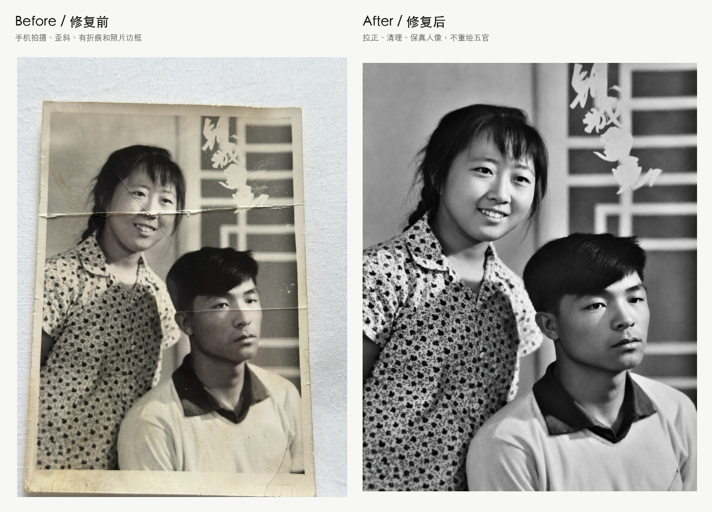

# Faithful Photo Restoration / 保真老照片修复

**Restore old family photos without turning real people into AI faces.**  
**修复老照片，但不把真实亲人修成 AI 生成的新脸。**



> Demo photo notice: images under `assets/demo/` are for viewing only and are not reusable.  
> 示例图片说明：`assets/demo/` 下的图片仅用于展示效果，不允许复用。详见 [`ASSET_LICENSE.md`](ASSET_LICENSE.md)。

AI old photo restoration is easy to demo and hard to deliver.

Most tools can make an old photo sharper. The hard part is making sure the restored result still shows the same people, has no phone-shot desk border, and does not quietly replace a family member with an AI-generated face.

大多数工具都能把老照片“变清楚”。真正难的是：照片要横平竖直、没有桌面背景、人物不能变、五官不能被 AI 重画，还要能作为最终成品交付。

**Faithful Photo Restoration** is a practical workflow and Codex skill for restoring scanned or phone-shot family photos with identity preservation as the first priority.

**保真老照片修复** 不是一个新模型，而是一套围绕 AI 修复的工作流和质检标准：先把手机拍的旧照片处理成“像平扫一样”的输入，再让 AI 单张修复，最后用人工/Agent 质量门槛防止改脸、换人、编造细节。

It is not another restoration model. It is the QA layer around AI restoration.

它的核心价值不是“更炫”，而是“更像原来的那张照片”。

## Why Star This / 为什么值得 Star

- **Faithful, not flashy.** The goal is a believable family archive photo, not a cinematic AI remake.
- **Built from a real 20-photo restoration workflow.** The process came from actual phone-shot old photos with folds, borders, skew, haze, and AI failure cases.
- **Human-in-the-loop by design.** AI outputs are candidates; quality gates decide what can become final.
- **Useful with ChatGPT, Codex, ComfyUI, Photoshop, or local scripts.** This repo defines the workflow and QA layer around whatever restoration tool you use.
- **适合真实家庭老照片。** 目标不是生成一张“看起来很厉害”的新图，而是保留原人物、原关系、原年代感。
- **来自真实 20 张老照片项目。** 包含手机拍摄、桌布背景、折痕穿脸、边框、歪斜、AI 改脸等真实问题。
- **AI 结果不是最终答案。** 每张都要过人物、五官、衣服、构图、边缘和清晰度检查。

## What This Project Does

- Straightens phone-shot old photos so they feel like flat scans.  
  把手机斜拍的老照片拉正，让它看起来像重新平扫。
- Removes desk/table background, album mats, paper borders, photo frames, date strips, and title edges.  
  裁掉桌布、桌面、相册底纸、纸边、相框、日期条和题字边框。
- Keeps black-and-white photos black-and-white and color photos color.  
  黑白照片默认保持黑白，彩色照片保持彩色，不主动上色。
- Uses AI restoration as a candidate, not an automatic final answer.  
  AI 修复结果只是候选，不自动当最终成品。
- Rejects AI outputs that redraw faces, add/remove people, change clothes, or invent details.  
  拒绝改脸、增删人物、换衣服、编造背景细节的结果。
- Falls back to conservative local repair when AI is unsafe.  
  AI 不稳定时，退回保守修复版本。
- Packages only final approved photos, avoiding candidate/source mix-ups.  
  只打包确认过的最终图，避免把错误候选图混进 zip。

## What This Project Does Not Do

- It does not provide a new neural network model.  
  这不是一个新神经网络模型。
- It does not promise one-click fully automatic restoration.  
  不承诺一键全自动处理所有老照片。
- It does not guarantee true facial reconstruction from extremely blurry or damaged sources.  
  对极度模糊或严重损坏的人脸，不承诺真实还原。
- It does not colorize by default.  
  默认不做黑白上色。

## Why It Exists

During a real 20-photo family restoration workflow, three failure modes showed up immediately:

1. **The photo was not actually scanned.** It was photographed on a table, so the desk, frame, paper edge, and skew had to be removed first.
2. **AI made some photos look better but less faithful.** Large group photos were especially risky because small faces could be redrawn.
3. **The wrong file can enter the final zip.** A zip file does not reduce image quality; if a zipped photo looks worse, the wrong source image probably entered the package.

This project turns those lessons into a repeatable workflow.

这个项目把这些踩坑经验整理成可复用流程：先做扫描化预处理，再做单张修复，再做保真验收。

## The Core Principle

> AI output is a candidate, not the final answer.

Every candidate must pass quality gates:

- Same people count.
- Same faces and age impression.
- Same clothing, pose, and scene relationship.
- No desk/table/frame/paper border.
- No glamour retouching or modernized details.
- Final package contains only approved finished images.

If a candidate fails, use a conservative local version.

## Repository Contents

```text
.
├── README.md
├── ASSET_LICENSE.md
├── assets/
│   └── demo/
│       ├── family-photo-before.jpg
│       ├── family-photo-after.jpg
│       └── family-photo-before-after.jpg
├── docs/implemented-scope.md
├── skills/
│   └── faithful-photo-restoration/
│       ├── SKILL.md
│       ├── agents/openai.yaml
│       └── references/
│           ├── prompt-templates.md
│           └── quality-gates.md
├── docs/
│   ├── workflow.md
│   ├── quality-gates.md
│   ├── prompts.md
│   ├── implemented-scope.md
│   ├── case-notes.md
│   └── launch-playbook.md
├── scripts/
│   └── pack-final-photos.sh
├── templates/
│   └── restoration-log.csv
└── articles/
    └── old-photo-restoration-skill-effect-and-logic.md
```

## Quick Start

1. Put your original photos in a private folder outside the repo.
2. Create a working folder for processed images.
3. For each photo, make a local baseline first:
   - rotate,
   - crop photographed borders,
   - lightly correct contrast,
   - lightly sharpen.
4. Send only the preprocessed photo to an AI image editor if needed.
5. Compare the AI candidate against the source using `docs/quality-gates.md`.
6. Accept the AI candidate only if it preserves identity.
7. Put approved finals in one folder.
8. Package them:

```bash
scripts/pack-final-photos.sh /path/to/final-photos /path/to/restored-photos.zip
```

## Current Scope

This repo implements the workflow, Codex skill, quality gates, prompt templates, and final packaging guardrail.

It does not yet include a one-click restoration app or a new model.

See [`docs/implemented-scope.md`](docs/implemented-scope.md) for the exact implemented scope.

## Use With Codex

The included skill can be copied to your Codex skills directory:

```bash
cp -R skills/faithful-photo-restoration ~/.codex/skills/
```

Then invoke it with:

```text
Use $faithful-photo-restoration to restore these old family photos faithfully.
```

## Suggested AI Prompt

For a typical old family photo:

```text
Restore this old family photo faithfully. Keep the same person/people, face identity, age, expression, clothing, pose, and background relationship. Remove dust, scratches, haze, stains, and mild fold damage. Improve clarity and contrast naturally. Do not beautify, do not modernize, do not add or remove people, do not change facial features, and do not invent details. Keep black-and-white photos black-and-white and color photos color.
```

More templates: [`docs/prompts.md`](docs/prompts.md)

## When To Use Conservative Repair

Use conservative local repair instead of AI restoration when:

- The image is a large group photo.
- Faces are too small to verify.
- The AI result makes faces look newly generated.
- A fold or scratch crosses a face and the model guesses too much.
- The restored photo looks impressive but no longer looks like the original person.

## Privacy

Do not commit family photos, restored private outputs, or model cache directories by default.

This repo intentionally ignores `outputs/`, `work/`, and common image-export folders by default. The included `assets/demo/` case is an explicitly approved public-facing demo, but it is **not reusable** and is **not covered by MIT**.

默认不要提交家庭照片、修复成品或模型缓存。本仓库默认忽略 `outputs/`、`work/` 和常见图片导出目录。当前 `assets/demo/` 是经明确同意用于公开展示的案例，但图片本身 **不允许复用**，也 **不属于 MIT 授权范围**。

## Star-Worthy Positioning

Most old-photo projects answer:

> How do I make this old photo sharper?

This project answers:

> How do I make this old photo better without changing who is in it?

That is the missing QA layer for AI photo restoration.

## License

Code, docs, prompts, templates, and workflow files are MIT licensed. See [`LICENSE`](LICENSE).

Demo photos under `assets/demo/` are not reusable and are not covered by MIT. See [`ASSET_LICENSE.md`](ASSET_LICENSE.md).

代码、文档、提示词、模板和工作流文件采用 MIT License。`assets/demo/` 下的演示照片不允许复用，不属于 MIT 授权范围。
